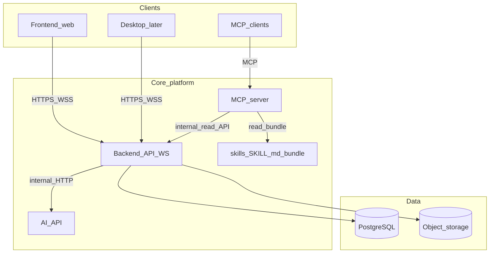

# InkEcho

InkEcho captures what you hear on your computer (meetings, lessons, calls), transcribes it in real time or near real time, and uses AI to produce summaries and structured notes. You can plug in third-party APIs or local, offline-capable models (OpenAI-compatible endpoints). Results can be exported in multiple document formats.

The long-term goal is **multi-device sync** and an **out-of-the-box** experience. Development starts as a **web-first** platform; a **desktop companion** for better system-audio capture is a later iteration.

---

## What InkEcho is (and is not)

- **In scope**: A **session** begins when you start listening/recording and ends when you stop. Heavy “create meeting” workflows are not required for v1—optional titles and tags can come later.
- **Focus**: Listen to audio that represents on-computer output, transcribe, then summarize (minutes, actions, recap).

---

## Web platform limitation: “system audio”

Browsers **cannot** silently tap global speaker output like a native loopback driver. Practical approaches:

1. **Screen or tab capture with audio** (`getDisplayMedia` with `audio: true`)—the user selects the tab, window, or screen that carries the meeting audio (common in Chromium-based browsers).
2. **File upload**—recordings from OBS, QuickTime, or other tools for offline transcription and summarization.
3. **Future desktop companion**—true loopback without repeated share prompts, using the same backend and account model.

---

## Four-service architecture

InkEcho is **four deployable services** with narrow contracts so you can scale, secure, and replace implementations without a monolith.

| Service | Role | Talks to |
|--------|------|----------|
| **Frontend** (`apps/web`) | React SPA: capture UX, transcript UI, settings, export downloads | **Backend** only (HTTP + WebSocket) |
| **Backend** (`apps/backend`) | Product API: auth, sessions, transcript storage, export jobs; **orchestrates** AI work; **does not** expose raw provider keys to the browser | PostgreSQL, object storage, **AI-API** (mTLS or signed service JWT), optional queue |
| **AI-API** (`apps/ai-api`) | Model boundary: streaming STT, chat/completions, future embeddings / RAG inference | Upstream LLM/STT (cloud or local OpenAI-compatible servers) |
| **MCP server** (`apps/mcp-server`) | MCP **data tools** for agents (sessions, transcripts, semantic search later) **plus** bundled **Agent Skills** (`SKILL.md` trees) exposed via MCP tools/resources (e.g. `list_skills`, `get_skill`) | **Backend** internal / read API (single authorization story); skills are read from the MCP bundle on disk |

**Trust boundary**: Browsers and MCP clients **do not** call AI-API directly. The backend decides when to transcribe or summarize, sends job descriptors and server-side credentials to AI-API, persists results, and streams progress to the web app. **Skills are non-secret instructional content** for agents (markdown only); API keys and private user data still flow through the backend only.

### Diagram



**Live transcript path**: Web → Backend (WebSocket) → AI-API (chunked HTTP or WebSocket) → Backend persists segments → Backend → Web.

---

## Suggested stack

| Piece | Choice | Notes |
|-------|--------|--------|
| Frontend | TypeScript + React (Vite) | Optional OpenAPI client codegen from the backend |
| Backend | Fastify, NestJS, or FastAPI | TS keeps product CRUD separate from ML; FastAPI for both backend and AI-API is fine if you want one Python surface |
| AI-API | Python + FastAPI (default) | Whisper / faster-whisper, streaming audio, embeddings, adapters to OpenAI-compatible APIs |
| MCP server | TypeScript (`@modelcontextprotocol/sdk`) or Python | Thin, I/O-bound |
| Data | PostgreSQL + S3-compatible storage | Backend owns persistence; AI-API stays stateless aside from ephemeral buffers |
| Real-time | WebSocket on **Backend** | Fan out partial transcripts and job status |

Provider adapters (**`TranscribeStream`**, **`ChatComplete`**, later **`Embed`**) live in **AI-API**. The **backend** stores user preferences and encrypted credentials; **prompt templates** (summary, action items, minutes) can be versioned on the backend and passed by id in jobs so copy changes do not require redeploying AI-API.

---

## Exports

- **v1**: Markdown, plain text, JSON (full session + segments).
- **Later**: DOCX, PDF via async jobs so exports do not block the API.

---

## MCP and RAG

- **MCP data tools**: `list_sessions`, `get_transcript`, `get_summary` call the backend HTTP API.
- **Cross-session RAG**: `semantic_search` and `rag_answer` call **`POST /rag/search`** and **`POST /rag/answer`** on the backend. Transcript chunks are embedded via **AI-API `POST /v1/embeddings`** (OpenAI- or OpenRouter-compatible, or deterministic **mock** vectors when no keys). For **OpenRouter**, prefer a non-`openai/*` embedding model (default **`intfloat/e5-base-v2`**)—`openai/text-embedding-3-small` via OpenRouter often returns **403 ToS**. After changing `OPENROUTER_EMBED_MODEL` or `EMBED_PROVIDER`, **re-index** sessions. Chunks are stored on the backend (JSON vectors in SQLite/Postgres today; **pgvector** remains an optional upgrade for very large corpora). **Indexing** runs automatically after transcription completes; you can rebuild with **`POST /rag/index/{session_id}`** or the Ask tab.

Ship the MCP server as its own artifact (e.g. Docker image or `npx` / `uv run` entrypoint).

### Agent skills in MCP

The MCP server ships a **bundled skill tree** (Cursor-style: `apps/mcp-server/skills/<skill-name>/SKILL.md` with YAML `name` and `description`, plus optional `reference.md` / scripts). Agents **discover** skills through MCP—recommended v1 tools: **`list_skills`** and **`get_skill`** (by skill id); **resources** (e.g. `ink-echo://skills/{name}`) are optional for hosts that prefer URI-based reads. Skills are **instructions only**; they do not replace backend auth or hold secrets.

**Bundled skills (target catalog)** — retrieval and embeddings remain in **backend + AI-API**; each skill tells the agent *how* to use tool outputs.

| Skill id | One-line purpose |
|----------|------------------|
| `meeting-minutes` | Structured minutes from one transcript: topics, decisions, open questions; link claims to timecodes/segment ids when available. |
| `action-items` | Extract who / what / by when; flag uncertainty; output task-friendly lists. |
| `summary-and-titles` | Short summary, one-line title, optional sections for UI and search snippets. |
| `export-prep` | Normalize content for Markdown, plain text, or JSON exports and downstream DOCX/PDF. |
| `quality-and-consistency` | Optional polish: glossary, name normalization, redaction rules (instructions only—no secrets in the file). |
| `cross-session-retrieval-answer` | After **RAG** tools (e.g. `semantic_search`, `rag_answer`, transcript chunks): cite sources (session id + chunk/span or quote + timestamp), structure the answer (direct answer first, then cited bullets), hedge or refuse when evidence is weak; do not invent meetings or quotes. |

**`cross-session-retrieval-answer`**: Vector search and generation are implemented in **backend** (`semantic_search` / `rag_answer` MCP tools → `/rag/*`) and **AI-API** (`/v1/embeddings`, `/v1/chat`). The skill only standardizes **citation format**, **answer shape**, and **safe hedging**; keep it in sync if JSON response shapes change.

---

## Repository layout (monorepo)

- `apps/web` — Frontend  
- `apps/backend` — Product API + WebSocket  
- `apps/ai-api` — STT / LLM / embeddings  
- `apps/mcp-server` — MCP process  
- `apps/mcp-server/skills/` — Bundled Agent Skills (`SKILL.md` per skill)  
- `packages/shared-types` — Shared DTOs / generated types (optional)  

---

## Roadmap (phased)

1. **MVP**: Run **web + backend + ai-api + mcp-server** locally (e.g. Compose); sessions and transcripts on the backend; web capture or upload; STT/LLM via AI-API; minimal MCP data tools **and** `list_skills` / `get_skill` over the bundled skill tree; export MD / TXT / JSON.
2. **Sync**: Real auth, multi-device session list, provider secrets only on the backend.
3. **Exports**: DOCX / PDF async on the backend.
4. **RAG**: Vectors in Postgres; semantic MCP tools.
5. **Desktop companion**: Loopback capture; still uses **backend** only.

---

## Risks and mitigations

- **Capture UX**: Onboarding for “share the tab with audio”; file upload fallback.
- **Latency**: Stream partial STT; optional fast draft model vs. final pass.
- **Privacy**: Local STT/LLM options and clear retention controls in later milestones.

---

## Status

Monorepo **scaffold** is in place: `apps/web`, `apps/backend`, `apps/ai-api`, `apps/mcp-server`, plus Docker Compose for Postgres and MinIO. **MVP (v1) complete** for local use: **sessions** + **audio upload** → **AI-API** `/v1/transcribe`, **WebSocket** segment fan-out, web **Listen / Transcribe / Sessions / Ask** (cross-session RAG UI calling `/rag/search` and `/rag/answer`), **POST /sessions/{id}/summarize** (AI-API `/v1/chat`), **exports** (`md` / `txt` / `json`), MCP **list_sessions** / **get_transcript** / **get_summary** / **semantic_search** / **rag_answer** plus **list_skills** / **get_skill**. **Next product phase** (per roadmap): real auth & sync, then DOCX/PDF exports, pgvector-scale RAG, desktop companion.

### Speech-to-text (AI-API)

InkEcho’s `/v1/transcribe` endpoint does **speech-to-text** (STT), not machine translation. You are **not** required to use OpenAI:

| Mode | Configuration |
|------|----------------|
| **OpenAI Whisper** | Set `OPENAI_API_KEY`. Optional: `OPENAI_BASE_URL` for compatible proxies. Uses `/v1/audio/transcriptions` with `whisper-1`. |
| **OpenRouter** | Set `OPENROUTER_API_KEY`. Set `STT_PROVIDER=openrouter` (or leave `STT_PROVIDER=auto` and omit `OPENAI_API_KEY` so OpenRouter is chosen). Optional: `OPENROUTER_TRANSCRIBE_MODEL` (default **`mistralai/voxtral-small-24b-2507`**). Set `OPENROUTER_HTTP_REFERER` / `OPENROUTER_X_TITLE` as [recommended](https://openrouter.ai/docs/quick-start). Uses `chat/completions` with base64 `input_audio`. When **`ffmpeg`** is on `PATH`, AI-API **normalizes** input to 16 kHz mono WAV. **`HTTPS_PROXY` / `HTTP_PROXY`** are respected (`httpx` `trust_env=True`) if your environment needs a proxy. **403** from OpenRouter often means [moderation](https://openrouter.ai/docs/errors) or the **upstream provider** rejected the call (not a “need VPN to reach openrouter.ai” issue if `curl` to `openrouter.ai` already works). Try another **audio** model, check credits/activity on OpenRouter, or use **`STT_PROVIDER=openai`** with `OPENAI_API_KEY`. |
| **Mock** | No keys: returns placeholder segments for pipeline testing. |

`STT_PROVIDER=auto` prefers **OpenAI** when `OPENAI_API_KEY` is set; otherwise **OpenRouter** if `OPENROUTER_API_KEY` is set.

**Claude / Anthropic:** there is no separate “Claude Code STT” drop-in here. Claude is a text (and some multimodal) model family; for **reliable batch transcription** the stack targets **Whisper-class** APIs. If OpenRouter exposes a model you want (including some multimodal chat models), point `OPENROUTER_TRANSCRIBE_MODEL` at it—check the provider’s supported **audio formats** (browser recordings are often **WebM**).

### Chat / summarize (AI-API `/v1/chat`)

Summaries use the same **OpenAI-compatible** `chat/completions` stack as above, controlled by **`CHAT_PROVIDER`** (`auto` | `openai` | `openrouter`). A **403** from OpenRouter with a message like **“violation of provider Terms Of Service”** usually means the **upstream model provider** (often **OpenAI** when the model id starts with `openai/`) is **declining the request**—commonly **region / billing / acceptable-use** rules—not a bug in InkEcho. **Mitigations:** pick a **non-OpenAI route** on OpenRouter (see [models](https://openrouter.ai/models); the repo default **`OPENROUTER_CHAT_MODEL`** avoids `openai/*`), use **`HTTPS_PROXY` / `HTTP_PROXY`** if your network requires it, or run **local** inference (**Ollama**, LM Studio, etc.) by setting **`OPENAI_BASE_URL`** to that server’s `/v1` URL and **`OPENAI_CHAT_MODEL`** to a pulled model name—**`OPENAI_API_KEY` may be left empty** when the base URL is **not** `https://api.openai.com/v1`.

## Local development (scaffold)

**One-shot (three HTTP/Web processes + MCP instructions):** from the repo root,

```bash
./scripts/dev-all.sh # frees 8000/8001/5173, starts three services in the background, terminal returns
./scripts/dev-all.sh --attach # same but blocks this terminal; Ctrl+C stops all three
./scripts/dev-all.sh --docker # same as first line, after docker compose up -d
./scripts/dev-all.sh --no-clean # skip port cleanup (only if you know nothing else needs those ports)
./scripts/stop-all.sh        # stop listeners on 8000 / 8001 / 5173 (+ recorded PIDs)
./scripts/stop-all.sh --force # if SIGTERM was not enough (SIGKILL)
```

Logs: `logs/backend.log`, `logs/ai-api.log`, `logs/web.log`. If startup fails, check those files. **Docker Desktop** or other tools sometimes bind **8000**; either stop that container or change the backend port in code and env.

`scripts/dev-all.sh` starts **MCP in `INK_ECHO_MCP_MODE=health-only`** on **:3033** so the web **Platform** menu can show MCP OK; that process does **not** expose stdio tools. For **Cursor** agents (`list_skills`, `get_skill`, `semantic_search`, `generate_meeting_minutes`, …), add **ink-echo-mcp** in Cursor MCP settings and set **`INK_ECHO_MCP_HEALTH_PORT=0`** if **3033** is already taken by dev-all. Bundled skills are **not** listed under Cursor **Settings → Skills**; they live in `apps/mcp-server/skills/` and are read via **`list_skills`** / **`get_skill`**.

1. **Infra (optional):** `docker compose up -d` for Postgres (`5432`) and MinIO if you want them. The backend **defaults to SQLite** under `apps/backend/data/` so you can run without Docker; set `DATABASE_URL` to a `postgresql://…` URL when using Compose Postgres.
2. **Backend** (`apps/backend`): `python3 -m venv .venv && source .venv/bin/activate && pip install -r requirements.txt`, then `uvicorn app.main:app --reload --host 127.0.0.1 --port 8000`. Settings read from the environment; you can place a `.env` in `apps/backend/` or export vars from the root `.env` (see `.env.example`).
3. **AI-API** (`apps/ai-api`): same pattern, `uvicorn app.main:app --reload --host 127.0.0.1 --port 8001`.
4. **Web** (`apps/web`): from repo root, `npm install` then `npm run dev:web` (uses `apps/web/vite.config.ts` so the root is always `apps/web`, even from the monorepo root). The dev server proxies `/api` → backend (default `http://127.0.0.1:8000`); open **http://127.0.0.1:5173/**. Alternative: `cd apps/web && npm run dev`. Meeting minutes and cross-session RAG calls are centralized in **`apps/web/src/inkecho/`** (`startMeetingMinutes`, `semanticSearch`, `ragAnswer`, …) so the UI matches the same backend routes MCP tools use.
5. **MCP server** (`apps/mcp-server`): stdio for MCP clients, plus **optional** HTTP **`GET /health`** on `127.0.0.1` (default port **3033**, override with `INK_ECHO_MCP_HEALTH_PORT`; set to `0` to disable). The web app’s **Platform** status uses the backend’s `GET /health/platform`, which probes **Web frontend**, **AI-API**, **MCP /health** (JSON `ok`, plus **`platform_detail`** describing the responding process: pid, mode, HTTP port, stdio). Legacy **`instances: { expected, healthy }`** is still accepted if present. Run e.g. `INK_ECHO_MCP_HEALTH_PORT=3033 node apps/mcp-server/dist/index.js` or `npm run dev:mcp` (set the env in your shell or MCP host config). Bundled skills live under `apps/mcp-server/skills/`. Override the directory with `INK_ECHO_SKILLS_DIR` if needed.

Root **npm** workspaces: `@ink-echo/web` and `@ink-echo/mcp-server`. Python apps keep their own `requirements.txt`.

## Testing the MCP server

InkEcho MCP uses **stdio** for the MCP protocol. The same process can expose **`http://127.0.0.1:3033/health`** (default; see `INK_ECHO_MCP_HEALTH_PORT`) so the backend can include MCP in **Platform** health. A client must still spawn `node …/dist/index.js` and talk over stdin/stdout.

### A. Official MCP Inspector (good for manual testing)

From the **repo root** (downloads the inspector via `npx` the first time):

```bash
npm run inspect:mcp
```

This builds `apps/mcp-server` and launches [@modelcontextprotocol/inspector](https://www.npmjs.com/package/@modelcontextprotocol/inspector). Open the UI (often **http://localhost:6274**), connect to the server it starts, then under **Tools** try e.g. **`list_skills`** or **`get_skill`** with arguments `{"skillId":"meeting-minutes"}`.

Non-interactive / terminal smoke test (no Inspector UI; uses SDK client):

```bash
npm run test:mcp
```

Inspector CLI (requires `--method` etc. for your inspector version):

```bash
npm run inspect:mcp:cli
```

Inspector may recommend **Node 22+**; if the UI fails to start, upgrade Node or use Cursor (below).

### B. Cursor

1. Run `npm run build:mcp` so `apps/mcp-server/dist/index.js` exists.
2. **Project config (recommended):** this repo includes **`.cursor/mcp.json`** — it runs the MCP server with `cwd` at the repo root, **`INK_ECHO_MCP_HEALTH_PORT=0`** (avoids clashing with `dev-all.sh`, which uses **3033** for Platform health-only), and **`INK_ECHO_BACKEND_URL=http://127.0.0.1:8000`**. **Restart Cursor** after pulling or editing MCP config.
3. Alternatively, add the same server under **Settings → MCP** using an absolute path in `args` if your Cursor build ignores `cwd` / `${workspaceFolder}`.

Optional env: `INK_ECHO_SKILLS_DIR` to point at a custom skills directory; `INK_ECHO_MCP_BACKEND_TOKEN` when the backend requires Bearer auth.

### C. Backend dependency

The current stub tools (`list_sessions`, `get_transcript`, …) do not require the FastAPI backend. When those call the real API, start `./scripts/dev-all.sh` (or at least the backend) before testing flows that hit InkEcho data.

## License

See [LICENSE](LICENSE).
