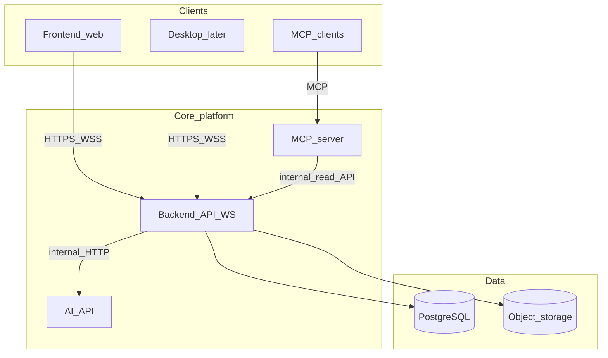

# InkEcho

InkEcho captures what you hear on your computer (meetings, lessons, calls), transcribes it in real time or near real time, and uses AI to produce summaries and structured notes. You can plug in third-party APIs or local, offline-capable models (OpenAI-compatible endpoints). Results can be exported in multiple document formats.

The long-term goal is **multi-device sync** and an **out-of-the-box** experience. Development starts as a **web-first** platform; a **desktop companion** for better system-audio capture is a later iteration.

---

## What InkEcho is (and is not)

- **In scope**: A **session** begins when you start listening/recording and ends when you stop. Heavy “create meeting” workflows are not required for v1—optional titles and tags can come later.
- **Focus**: Listen to audio that represents on-computer output, transcribe, then summarize (minutes, actions, recap).

---

## Web platform limitation: “system audio”

Browsers **cannot** silently tap global speaker output like a native loopback driver. Practical approaches:

1. **Screen or tab capture with audio** (`getDisplayMedia` with `audio: true`)—the user selects the tab, window, or screen that carries the meeting audio (common in Chromium-based browsers).
2. **File upload**—recordings from OBS, QuickTime, or other tools for offline transcription and summarization.
3. **Future desktop companion**—true loopback without repeated share prompts, using the same backend and account model.

---

## Four-service architecture

InkEcho is **four deployable services** with narrow contracts so you can scale, secure, and replace implementations without a monolith.

| Service | Role | Talks to |
|--------|------|----------|
| **Frontend** (`apps/web`) | React SPA: capture UX, transcript UI, settings, export downloads | **Backend** only (HTTP + WebSocket) |
| **Backend** (`apps/backend`) | Product API: auth, sessions, transcript storage, export jobs; **orchestrates** AI work; **does not** expose raw provider keys to the browser | PostgreSQL, object storage, **AI-API** (mTLS or signed service JWT), optional queue |
| **AI-API** (`apps/ai-api`) | Model boundary: streaming STT, chat/completions, future embeddings / RAG inference | Upstream LLM/STT (cloud or local OpenAI-compatible servers) |
| **MCP server** (`apps/mcp-server`) | MCP tools for agents (list sessions, fetch transcript, search—semantic later) | **Backend** internal / read API (single authorization story) |

**Trust boundary**: Browsers and MCP clients **do not** call AI-API directly. The backend decides when to transcribe or summarize, sends job descriptors and server-side credentials to AI-API, persists results, and streams progress to the web app.

### Diagram

**Live transcript path**: Web → Backend (WebSocket) → AI-API (chunked HTTP or WebSocket) → Backend persists segments → Backend → Web.

---

## Suggested stack

| Piece | Choice | Notes |
|-------|--------|--------|
| Frontend | TypeScript + React (Vite) | Optional OpenAPI client codegen from the backend |
| Backend | Fastify, NestJS, or FastAPI | TS keeps product CRUD separate from ML; FastAPI for both backend and AI-API is fine if you want one Python surface |
| AI-API | Python + FastAPI (default) | Whisper / faster-whisper, streaming audio, embeddings, adapters to OpenAI-compatible APIs |
| MCP server | TypeScript (`@modelcontextprotocol/sdk`) or Python | Thin, I/O-bound |
| Data | PostgreSQL + S3-compatible storage | Backend owns persistence; AI-API stays stateless aside from ephemeral buffers |
| Real-time | WebSocket on **Backend** | Fan out partial transcripts and job status |

Provider adapters (**`TranscribeStream`**, **`ChatComplete`**, later **`Embed`**) live in **AI-API**. The **backend** stores user preferences and encrypted credentials; **prompt templates** (summary, action items, minutes) can be versioned on the backend and passed by id in jobs so copy changes do not require redeploying AI-API.

---

## Exports

- **v1**: Markdown, plain text, JSON (full session + segments).
- **Later**: DOCX, PDF via async jobs so exports do not block the API.

---

## MCP and RAG

- **MCP v1** (examples): `list_sessions`, `get_transcript`, `get_summary`—implemented against backend internal routes, not direct database access from the MCP process.
- **Later**: `semantic_search` / `rag_answer` via backend + AI-API (embed + retrieve); MCP tool names stay stable while implementations evolve.
- **RAG**: embeddings and vector storage (e.g. pgvector); ingestion triggered after transcript finalization; heavy work in AI-API or a queue worker.

Ship the MCP server as its own artifact (e.g. Docker image or `npx` / `uv run` entrypoint).

---

## Repository layout (target monorepo)

- `apps/web` — Frontend  
- `apps/backend` — Product API + WebSocket  
- `apps/ai-api` — STT / LLM / embeddings  
- `apps/mcp-server` — MCP process  
- `packages/shared-types` — Shared DTOs / generated types (optional)  

---

## Roadmap (phased)

1. **MVP**: Run **web + backend + ai-api + mcp-server** locally (e.g. Compose); sessions and transcripts on the backend; web capture or upload; STT/LLM via AI-API; minimal MCP read tools; export MD / TXT / JSON.
2. **Sync**: Real auth, multi-device session list, provider secrets only on the backend.
3. **Exports**: DOCX / PDF async on the backend.
4. **RAG**: Vectors in Postgres; semantic MCP tools.
5. **Desktop companion**: Loopback capture; still uses **backend** only.

---

## Risks and mitigations

- **Capture UX**: Onboarding for “share the tab with audio”; file upload fallback.
- **Latency**: Stream partial STT; optional fast draft model vs. final pass.
- **Privacy**: Local STT/LLM options and clear retention controls in later milestones.

---

## Status

This repository is **greenfield**: architecture and scope are defined here; implementation (scaffolding the four apps, APIs, and local dev orchestration) follows in code.

## License

See [LICENSE](LICENSE).
